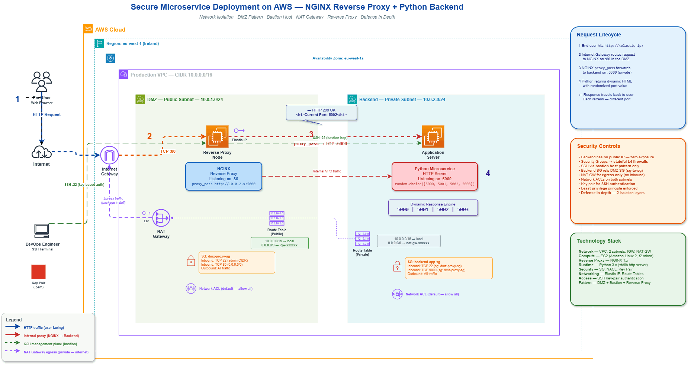

# Secure Microservice Deployment on AWS

## NGINX Reverse Proxy + Python Backend

> Network Isolation. DMZ Pattern. Bastion Host.
> NAT Gateway. Reverse Proxy. Defense in Depth.

---

## Architecture Overview

A production-grade cloud architecture deployed on AWS
featuring complete network isolation between a public-facing
reverse proxy and a hidden backend application server.

The end user interacts with NGINX on port 80 in the DMZ.
NGINX forwards requests to a Python microservice on port 5000
in a private subnet with no public IP and zero direct
internet exposure.

---

## Architecture Diagram

## Request Lifecycle

1. End user navigates to the Elastic IP
2. Internet Gateway routes to NGINX on port 80
3. NGINX proxy_pass forwards to backend on port 5000
4. Python returns dynamic HTML with randomized port
5. Response travels back to the user's browser

---

## Security Controls

- Backend has no public IP — zero exposure
- Security Groups act as stateful L4 firewalls
- SSH access via bastion host pattern only
- Backend SG references DMZ SG (sg-to-sg)
- NAT Gateway for egress only (no inbound)
- Network ACLs on both subnets
- Key pair for SSH authentication
- Least privilege principle enforced
- Defense in depth — 2 isolation layers

---

## How to Reproduce

### Step 1: Create the VPC
- CIDR: 10.0.0.0/16

### Step 2: Create Subnets
- Public: 10.0.1.0/24
- Private: 10.0.2.0/24

### Step 3: Create and Attach Internet Gateway

### Step 4: Create NAT Gateway in Public Subnet

### Step 5: Configure Route Tables
- Public: 0.0.0.0/0 → IGW
- Private: 0.0.0.0/0 → NAT Gateway

### Step 6: Launch EC2 Instances
- Reverse Proxy in Public Subnet
- Application Server in Private Subnet

### Step 7: Configure Security Groups
- DMZ: Allow TCP 80 from 0.0.0.0/0, TCP 22 from admin CIDR
- Backend: Allow TCP 5000 and TCP 22 from dmz-proxy-sg only

### Step 8: Install and Configure NGINX

### Step 9: Deploy Python Microservice

### Step 10: Test the Full Flow

---

## Author

**Nathan NKULU EL BANZE**
AWS re/Start — Orange Digital Center RDC
Kinshasa, Democratic Republic of Congo

---

*The best is ahead.*
